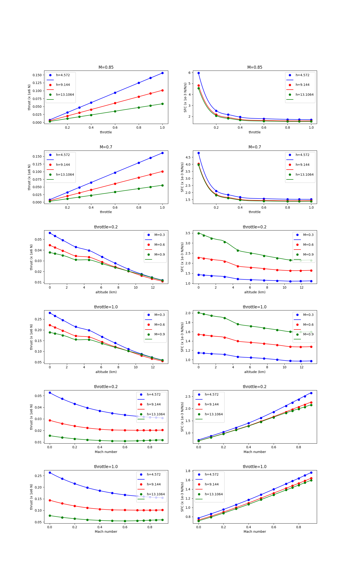

Boeing 777 engine data set
==========================

.. code-block:: python

  import numpy as np
  import os
  
  
  def get_b777_engine():
      this_dir = os.path.split(__file__)[0]
  
      nt = 12 * 11 * 8
      xt = np.loadtxt(os.path.join(this_dir, "b777_engine_inputs.dat")).reshape((nt, 3))
      yt = np.loadtxt(os.path.join(this_dir, "b777_engine_outputs.dat")).reshape((nt, 2))
      dyt_dxt = np.loadtxt(os.path.join(this_dir, "b777_engine_derivs.dat")).reshape(
          (nt, 2, 3)
      )
  
      xlimits = np.array([[0, 0.9], [0, 15], [0, 1.0]])
  
      return xt, yt, dyt_dxt, xlimits
  
  
  def plot_b777_engine(xt, yt, limits, interp):
      import numpy as np
      import matplotlib
  
      matplotlib.use("Agg")
      import matplotlib.pyplot as plt
  
      val_M = np.array(
          [0.0, 0.1, 0.2, 0.3, 0.4, 0.5, 0.6, 0.7, 0.75, 0.8, 0.85, 0.9]
      )  # 12
      val_h = np.array(
          [0.0, 0.6096, 1.524, 3.048, 4.572, 6.096, 7.62, 9.144, 10.668, 11.8872, 13.1064]
      )  # 11
      val_t = np.array([0.05, 0.2, 0.3, 0.4, 0.6, 0.8, 0.9, 1.0])  # 8
  
      def get_pts(xt, yt, iy, ind_M=None, ind_h=None, ind_t=None):
          eps = 1e-5
  
          if ind_M is not None:
              M = val_M[ind_M]
              keep = abs(xt[:, 0] - M) < eps
              xt = xt[keep, :]
              yt = yt[keep, :]
          if ind_h is not None:
              h = val_h[ind_h]
              keep = abs(xt[:, 1] - h) < eps
              xt = xt[keep, :]
              yt = yt[keep, :]
          if ind_t is not None:
              t = val_t[ind_t]
              keep = abs(xt[:, 2] - t) < eps
              xt = xt[keep, :]
              yt = yt[keep, :]
  
          if ind_M is None:
              data = xt[:, 0], yt[:, iy]
          elif ind_h is None:
              data = xt[:, 1], yt[:, iy]
          elif ind_t is None:
              data = xt[:, 2], yt[:, iy]
  
          if iy == 0:
              data = data[0], data[1] / 1e6
          elif iy == 1:
              data = data[0], data[1] / 1e-4
  
          return data
  
      num = 100
      x = np.zeros((num, 3))
      lins_M = np.linspace(0.0, 0.9, num)
      lins_h = np.linspace(0.0, 13.1064, num)
      lins_t = np.linspace(0.05, 1.0, num)
  
      def get_x(ind_M=None, ind_h=None, ind_t=None):
          x = np.zeros((num, 3))
          x[:, 0] = lins_M
          x[:, 1] = lins_h
          x[:, 2] = lins_t
          if ind_M:
              x[:, 0] = val_M[ind_M]
          if ind_h:
              x[:, 1] = val_h[ind_h]
          if ind_t:
              x[:, 2] = val_t[ind_t]
          return x
  
      nrow = 6
      ncol = 2
  
      ind_M_1 = -2
      ind_M_2 = -5
  
      ind_t_1 = 1
      ind_t_2 = -1
  
      plt.close()
  
      # --------------------
  
      fig, axs = plt.subplots(6, 2, gridspec_kw={"hspace": 0.5}, figsize=(15, 25))
  
      axs[0, 0].set_title("M={}".format(val_M[ind_M_1]))
      axs[0, 0].set(xlabel="throttle", ylabel="thrust (x 1e6 N)")
  
      axs[0, 1].set_title("M={}".format(val_M[ind_M_1]))
      axs[0, 1].set(xlabel="throttle", ylabel="SFC (x 1e-3 N/N/s)")
  
      axs[1, 0].set_title("M={}".format(val_M[ind_M_2]))
      axs[1, 0].set(xlabel="throttle", ylabel="thrust (x 1e6 N)")
  
      axs[1, 1].set_title("M={}".format(val_M[ind_M_2]))
      axs[1, 1].set(xlabel="throttle", ylabel="SFC (x 1e-3 N/N/s)")
  
      # --------------------
  
      axs[2, 0].set_title("throttle={}".format(val_t[ind_t_1]))
      axs[2, 0].set(xlabel="altitude (km)", ylabel="thrust (x 1e6 N)")
  
      axs[2, 1].set_title("throttle={}".format(val_t[ind_t_1]))
      axs[2, 1].set(xlabel="altitude (km)", ylabel="SFC (x 1e-3 N/N/s)")
  
      axs[3, 0].set_title("throttle={}".format(val_t[ind_t_2]))
      axs[3, 0].set(xlabel="altitude (km)", ylabel="thrust (x 1e6 N)")
  
      axs[3, 1].set_title("throttle={}".format(val_t[ind_t_2]))
      axs[3, 1].set(xlabel="altitude (km)", ylabel="SFC (x 1e-3 N/N/s)")
  
      # --------------------
  
      axs[4, 0].set_title("throttle={}".format(val_t[ind_t_1]))
      axs[4, 0].set(xlabel="Mach number", ylabel="thrust (x 1e6 N)")
  
      axs[4, 1].set_title("throttle={}".format(val_t[ind_t_1]))
      axs[4, 1].set(xlabel="Mach number", ylabel="SFC (x 1e-3 N/N/s)")
  
      axs[5, 0].set_title("throttle={}".format(val_t[ind_t_2]))
      axs[5, 0].set(xlabel="Mach number", ylabel="thrust (x 1e6 N)")
  
      axs[5, 1].set_title("throttle={}".format(val_t[ind_t_2]))
      axs[5, 1].set(xlabel="Mach number", ylabel="SFC (x 1e-3 N/N/s)")
  
      ind_h_list = [0, 4, 7, 10]
      ind_h_list = [4, 7, 10]
  
      ind_M_list = [0, 3, 6, 11]
      ind_M_list = [3, 6, 11]
  
      colors = ["b", "r", "g", "c", "m"]
  
      # -----------------------------------------------------------------------------
  
      # Throttle slices
      for k, ind_h in enumerate(ind_h_list):
          ind_M = ind_M_1
          x = get_x(ind_M=ind_M, ind_h=ind_h)
          y = interp.predict_values(x)
  
          xt_, yt_ = get_pts(xt, yt, 0, ind_M=ind_M, ind_h=ind_h)
          axs[0, 0].plot(xt_, yt_, "o" + colors[k])
          axs[0, 0].plot(lins_t, y[:, 0] / 1e6, colors[k])
  
          xt_, yt_ = get_pts(xt, yt, 1, ind_M=ind_M, ind_h=ind_h)
          axs[0, 1].plot(xt_, yt_, "o" + colors[k])
          axs[0, 1].plot(lins_t, y[:, 1] / 1e-4, colors[k])
  
          ind_M = ind_M_2
          x = get_x(ind_M=ind_M, ind_h=ind_h)
          y = interp.predict_values(x)
  
          xt_, yt_ = get_pts(xt, yt, 0, ind_M=ind_M, ind_h=ind_h)
          axs[1, 0].plot(xt_, yt_, "o" + colors[k])
          axs[1, 0].plot(lins_t, y[:, 0] / 1e6, colors[k])
  
          xt_, yt_ = get_pts(xt, yt, 1, ind_M=ind_M, ind_h=ind_h)
          axs[1, 1].plot(xt_, yt_, "o" + colors[k])
          axs[1, 1].plot(lins_t, y[:, 1] / 1e-4, colors[k])
  
      # -----------------------------------------------------------------------------
  
      # Altitude slices
      for k, ind_M in enumerate(ind_M_list):
          ind_t = ind_t_1
          x = get_x(ind_M=ind_M, ind_t=ind_t)
          y = interp.predict_values(x)
  
          xt_, yt_ = get_pts(xt, yt, 0, ind_M=ind_M, ind_t=ind_t)
          axs[2, 0].plot(xt_, yt_, "o" + colors[k])
          axs[2, 0].plot(lins_h, y[:, 0] / 1e6, colors[k])
  
          xt_, yt_ = get_pts(xt, yt, 1, ind_M=ind_M, ind_t=ind_t)
          axs[2, 1].plot(xt_, yt_, "o" + colors[k])
          axs[2, 1].plot(lins_h, y[:, 1] / 1e-4, colors[k])
  
          ind_t = ind_t_2
          x = get_x(ind_M=ind_M, ind_t=ind_t)
          y = interp.predict_values(x)
  
          xt_, yt_ = get_pts(xt, yt, 0, ind_M=ind_M, ind_t=ind_t)
          axs[3, 0].plot(xt_, yt_, "o" + colors[k])
          axs[3, 0].plot(lins_h, y[:, 0] / 1e6, colors[k])
  
          xt_, yt_ = get_pts(xt, yt, 1, ind_M=ind_M, ind_t=ind_t)
          axs[3, 1].plot(xt_, yt_, "o" + colors[k])
          axs[3, 1].plot(lins_h, y[:, 1] / 1e-4, colors[k])
  
      # -----------------------------------------------------------------------------
  
      # Mach number slices
      for k, ind_h in enumerate(ind_h_list):
          ind_t = ind_t_1
          x = get_x(ind_t=ind_t, ind_h=ind_h)
          y = interp.predict_values(x)
  
          xt_, yt_ = get_pts(xt, yt, 0, ind_h=ind_h, ind_t=ind_t)
          axs[4, 0].plot(xt_, yt_, "o" + colors[k])
          axs[4, 0].plot(lins_M, y[:, 0] / 1e6, colors[k])
  
          xt_, yt_ = get_pts(xt, yt, 1, ind_h=ind_h, ind_t=ind_t)
          axs[4, 1].plot(xt_, yt_, "o" + colors[k])
          axs[4, 1].plot(lins_M, y[:, 1] / 1e-4, colors[k])
  
          ind_t = ind_t_2
          x = get_x(ind_t=ind_t, ind_h=ind_h)
          y = interp.predict_values(x)
  
          xt_, yt_ = get_pts(xt, yt, 0, ind_h=ind_h, ind_t=ind_t)
          axs[5, 0].plot(xt_, yt_, "o" + colors[k])
          axs[5, 0].plot(lins_M, y[:, 0] / 1e6, colors[k])
  
          xt_, yt_ = get_pts(xt, yt, 1, ind_h=ind_h, ind_t=ind_t)
          axs[5, 1].plot(xt_, yt_, "o" + colors[k])
          axs[5, 1].plot(lins_M, y[:, 1] / 1e-4, colors[k])
  
      # -----------------------------------------------------------------------------
  
      for k in range(2):
          legend_entries = []
          for ind_h in ind_h_list:
              legend_entries.append("h={}".format(val_h[ind_h]))
              legend_entries.append("")
  
          axs[k, 0].legend(legend_entries)
          axs[k, 1].legend(legend_entries)
  
          axs[k + 4, 0].legend(legend_entries)
          axs[k + 4, 1].legend(legend_entries)
  
          legend_entries = []
          for ind_M in ind_M_list:
              legend_entries.append("M={}".format(val_M[ind_M]))
              legend_entries.append("")
  
          axs[k + 2, 0].legend(legend_entries)
          axs[k + 2, 1].legend(legend_entries)
  
      plt.show()
  

RMTB
----

.. code-block:: python

  from smt.surrogate_models import RMTB
  from smt.examples.b777_engine.b777_engine import get_b777_engine, plot_b777_engine
  
  xt, yt, dyt_dxt, xlimits = get_b777_engine()
  
  interp = RMTB(
      num_ctrl_pts=15,
      xlimits=xlimits,
      nonlinear_maxiter=20,
      approx_order=2,
      energy_weight=0e-14,
      regularization_weight=0e-18,
      extrapolate=True,
  )
  interp.set_training_values(xt, yt)
  interp.set_training_derivatives(xt, dyt_dxt[:, :, 0], 0)
  interp.set_training_derivatives(xt, dyt_dxt[:, :, 1], 1)
  interp.set_training_derivatives(xt, dyt_dxt[:, :, 2], 2)
  interp.train()
  
  plot_b777_engine(xt, yt, xlimits, interp)
  
::

  ___________________________________________________________________________
     
                                     RMTB
  ___________________________________________________________________________
     
   Problem size
     
        # training points.        : 1056
     
  ___________________________________________________________________________
     
   Training
     
     Training ...
        Pre-computing matrices ...
           Computing dof2coeff ...
           Computing dof2coeff - done. Time (sec):  0.0000000
           Initializing Hessian ...
           Initializing Hessian - done. Time (sec):  0.0001690
           Computing energy terms ...
           Computing energy terms - done. Time (sec):  0.1026030
           Computing approximation terms ...
           Computing approximation terms - done. Time (sec):  0.0037448
        Pre-computing matrices - done. Time (sec):  0.1065509
        Solving for degrees of freedom ...
           Solving initial startup problem (n=3375) ...
              Solving for output 0 ...
                 Iteration (num., iy, grad. norm, func.) :   0   0 4.857178281e+07 2.642628384e+13
                 Iteration (num., iy, grad. norm, func.) :   0   0 1.287760147e+05 7.013862486e+09
              Solving for output 0 - done. Time (sec):  0.0471802
              Solving for output 1 ...
                 Iteration (num., iy, grad. norm, func.) :   0   1 3.711896708e-01 7.697335516e-04
                 Iteration (num., iy, grad. norm, func.) :   0   1 1.237398927e-03 3.529724870e-07
              Solving for output 1 - done. Time (sec):  0.0433509
           Solving initial startup problem (n=3375) - done. Time (sec):  0.0907438
           Solving nonlinear problem (n=3375) ...
              Solving for output 0 ...
                 Iteration (num., iy, grad. norm, func.) :   0   0 1.287760147e+05 7.013862486e+09
                 Iteration (num., iy, grad. norm, func.) :   0   0 7.761411086e+04 1.944214555e+09
                 Iteration (num., iy, grad. norm, func.) :   1   0 4.710947159e+04 5.656224271e+08
                 Iteration (num., iy, grad. norm, func.) :   2   0 3.467796292e+04 3.929616835e+08
                 Iteration (num., iy, grad. norm, func.) :   3   0 3.167215496e+04 3.815260851e+08
                 Iteration (num., iy, grad. norm, func.) :   4   0 2.235582966e+04 3.298298276e+08
                 Iteration (num., iy, grad. norm, func.) :   5   0 1.594366048e+04 3.033193478e+08
                 Iteration (num., iy, grad. norm, func.) :   6   0 1.257333549e+04 2.690691594e+08
                 Iteration (num., iy, grad. norm, func.) :   7   0 1.550624725e+04 2.253259851e+08
                 Iteration (num., iy, grad. norm, func.) :   8   0 9.545510027e+03 2.026202991e+08
                 Iteration (num., iy, grad. norm, func.) :   9   0 1.019183035e+04 1.871179971e+08
                 Iteration (num., iy, grad. norm, func.) :  10   0 7.827721077e+03 1.772067504e+08
                 Iteration (num., iy, grad. norm, func.) :  11   0 6.173693358e+03 1.683557165e+08
                 Iteration (num., iy, grad. norm, func.) :  12   0 7.019807356e+03 1.629959092e+08
                 Iteration (num., iy, grad. norm, func.) :  13   0 5.534057076e+03 1.598377371e+08
                 Iteration (num., iy, grad. norm, func.) :  14   0 5.384357459e+03 1.582829492e+08
                 Iteration (num., iy, grad. norm, func.) :  15   0 3.166081030e+03 1.555721305e+08
                 Iteration (num., iy, grad. norm, func.) :  16   0 3.376608953e+03 1.520283977e+08
                 Iteration (num., iy, grad. norm, func.) :  17   0 1.868740540e+03 1.497626918e+08
                 Iteration (num., iy, grad. norm, func.) :  18   0 3.235492848e+03 1.485419141e+08
                 Iteration (num., iy, grad. norm, func.) :  19   0 9.119516369e+02 1.482064670e+08
              Solving for output 0 - done. Time (sec):  0.9208639
              Solving for output 1 ...
                 Iteration (num., iy, grad. norm, func.) :   0   1 1.237398927e-03 3.529724870e-07
                 Iteration (num., iy, grad. norm, func.) :   0   1 3.641316804e-04 6.193299823e-08
                 Iteration (num., iy, grad. norm, func.) :   1   1 2.894343667e-04 1.818343917e-08
                 Iteration (num., iy, grad. norm, func.) :   2   1 1.672005230e-04 8.506487454e-09
                 Iteration (num., iy, grad. norm, func.) :   3   1 1.393833697e-04 7.835877901e-09
                 Iteration (num., iy, grad. norm, func.) :   4   1 1.064691421e-04 6.765880153e-09
                 Iteration (num., iy, grad. norm, func.) :   5   1 1.002421194e-04 5.099853431e-09
                 Iteration (num., iy, grad. norm, func.) :   6   1 3.975667972e-05 2.942127643e-09
                 Iteration (num., iy, grad. norm, func.) :   7   1 4.340742257e-05 2.098885066e-09
                 Iteration (num., iy, grad. norm, func.) :   8   1 2.252674092e-05 1.815803346e-09
                 Iteration (num., iy, grad. norm, func.) :   9   1 2.722319753e-05 1.709736872e-09
                 Iteration (num., iy, grad. norm, func.) :  10   1 2.015808550e-05 1.572815473e-09
                 Iteration (num., iy, grad. norm, func.) :  11   1 2.716441331e-05 1.423812500e-09
                 Iteration (num., iy, grad. norm, func.) :  12   1 1.047202430e-05 1.304404854e-09
                 Iteration (num., iy, grad. norm, func.) :  13   1 1.656730368e-05 1.248577704e-09
                 Iteration (num., iy, grad. norm, func.) :  14   1 7.895475757e-06 1.214052849e-09
                 Iteration (num., iy, grad. norm, func.) :  15   1 8.154256470e-06 1.203577197e-09
                 Iteration (num., iy, grad. norm, func.) :  16   1 7.307173193e-06 1.182790918e-09
                 Iteration (num., iy, grad. norm, func.) :  17   1 8.482530249e-06 1.155343954e-09
                 Iteration (num., iy, grad. norm, func.) :  18   1 5.626204055e-06 1.138106185e-09
                 Iteration (num., iy, grad. norm, func.) :  19   1 5.361846694e-06 1.134750007e-09
              Solving for output 1 - done. Time (sec):  0.8602221
           Solving nonlinear problem (n=3375) - done. Time (sec):  1.7811399
        Solving for degrees of freedom - done. Time (sec):  1.8719180
     Training - done. Time (sec):  1.9789038
  ___________________________________________________________________________
     
   Evaluation
     
        # eval points. : 100
     
     Predicting ...
     Predicting - done. Time (sec):  0.0004978
     
     Prediction time/pt. (sec) :  0.0000050
     
  ___________________________________________________________________________
     
   Evaluation
     
        # eval points. : 100
     
     Predicting ...
     Predicting - done. Time (sec):  0.0003579
     
     Prediction time/pt. (sec) :  0.0000036
     
  ___________________________________________________________________________
     
   Evaluation
     
        # eval points. : 100
     
     Predicting ...
     Predicting - done. Time (sec):  0.0003510
     
     Prediction time/pt. (sec) :  0.0000035
     
  ___________________________________________________________________________
     
   Evaluation
     
        # eval points. : 100
     
     Predicting ...
     Predicting - done. Time (sec):  0.0003479
     
     Prediction time/pt. (sec) :  0.0000035
     
  ___________________________________________________________________________
     
   Evaluation
     
        # eval points. : 100
     
     Predicting ...
     Predicting - done. Time (sec):  0.0003452
     
     Prediction time/pt. (sec) :  0.0000035
     
  ___________________________________________________________________________
     
   Evaluation
     
        # eval points. : 100
     
     Predicting ...
     Predicting - done. Time (sec):  0.0003519
     
     Prediction time/pt. (sec) :  0.0000035
     
  ___________________________________________________________________________
     
   Evaluation
     
        # eval points. : 100
     
     Predicting ...
     Predicting - done. Time (sec):  0.0003490
     
     Prediction time/pt. (sec) :  0.0000035
     
  ___________________________________________________________________________
     
   Evaluation
     
        # eval points. : 100
     
     Predicting ...
     Predicting - done. Time (sec):  0.0003483
     
     Prediction time/pt. (sec) :  0.0000035
     
  ___________________________________________________________________________
     
   Evaluation
     
        # eval points. : 100
     
     Predicting ...
     Predicting - done. Time (sec):  0.0003541
     
     Prediction time/pt. (sec) :  0.0000035
     
  ___________________________________________________________________________
     
   Evaluation
     
        # eval points. : 100
     
     Predicting ...
     Predicting - done. Time (sec):  0.0004170
     
     Prediction time/pt. (sec) :  0.0000042
     
  ___________________________________________________________________________
     
   Evaluation
     
        # eval points. : 100
     
     Predicting ...
     Predicting - done. Time (sec):  0.0003519
     
     Prediction time/pt. (sec) :  0.0000035
     
  ___________________________________________________________________________
     
   Evaluation
     
        # eval points. : 100
     
     Predicting ...
     Predicting - done. Time (sec):  0.0003431
     
     Prediction time/pt. (sec) :  0.0000034
     
  ___________________________________________________________________________
     
   Evaluation
     
        # eval points. : 100
     
     Predicting ...
     Predicting - done. Time (sec):  0.0003409
     
     Prediction time/pt. (sec) :  0.0000034
     
  ___________________________________________________________________________
     
   Evaluation
     
        # eval points. : 100
     
     Predicting ...
     Predicting - done. Time (sec):  0.0003438
     
     Prediction time/pt. (sec) :  0.0000034
     
  ___________________________________________________________________________
     
   Evaluation
     
        # eval points. : 100
     
     Predicting ...
     Predicting - done. Time (sec):  0.0003400
     
     Prediction time/pt. (sec) :  0.0000034
     
  ___________________________________________________________________________
     
   Evaluation
     
        # eval points. : 100
     
     Predicting ...
     Predicting - done. Time (sec):  0.0003428
     
     Prediction time/pt. (sec) :  0.0000034
     
  ___________________________________________________________________________
     
   Evaluation
     
        # eval points. : 100
     
     Predicting ...
     Predicting - done. Time (sec):  0.0003421
     
     Prediction time/pt. (sec) :  0.0000034
     
  ___________________________________________________________________________
     
   Evaluation
     
        # eval points. : 100
     
     Predicting ...
     Predicting - done. Time (sec):  0.0003510
     
     Prediction time/pt. (sec) :  0.0000035
     
  

RMTC
----

.. code-block:: python

  from smt.surrogate_models import RMTC
  from smt.examples.b777_engine.b777_engine import get_b777_engine, plot_b777_engine
  
  xt, yt, dyt_dxt, xlimits = get_b777_engine()
  
  interp = RMTC(
      num_elements=6,
      xlimits=xlimits,
      nonlinear_maxiter=20,
      approx_order=2,
      energy_weight=0.0,
      regularization_weight=0.0,
      extrapolate=True,
  )
  interp.set_training_values(xt, yt)
  interp.set_training_derivatives(xt, dyt_dxt[:, :, 0], 0)
  interp.set_training_derivatives(xt, dyt_dxt[:, :, 1], 1)
  interp.set_training_derivatives(xt, dyt_dxt[:, :, 2], 2)
  interp.train()
  
  plot_b777_engine(xt, yt, xlimits, interp)
  
::

  ___________________________________________________________________________
     
                                     RMTC
  ___________________________________________________________________________
     
   Problem size
     
        # training points.        : 1056
     
  ___________________________________________________________________________
     
   Training
     
     Training ...
        Pre-computing matrices ...
           Computing dof2coeff ...
           Computing dof2coeff - done. Time (sec):  0.0100570
           Initializing Hessian ...
           Initializing Hessian - done. Time (sec):  0.0001681
           Computing energy terms ...
           Computing energy terms - done. Time (sec):  0.1242938
           Computing approximation terms ...
           Computing approximation terms - done. Time (sec):  0.0480719
        Pre-computing matrices - done. Time (sec):  0.1826460
        Solving for degrees of freedom ...
           Solving initial startup problem (n=2744) ...
              Solving for output 0 ...
                 Iteration (num., iy, grad. norm, func.) :   0   0 7.864862172e+07 2.642628384e+13
                 Iteration (num., iy, grad. norm, func.) :   0   0 1.966048043e+05 2.068961442e+09
              Solving for output 0 - done. Time (sec):  0.1229322
              Solving for output 1 ...
                 Iteration (num., iy, grad. norm, func.) :   0   1 8.095040141e-01 7.697335516e-04
                 Iteration (num., iy, grad. norm, func.) :   0   1 1.590628922e-03 1.331263764e-07
              Solving for output 1 - done. Time (sec):  0.0969148
           Solving initial startup problem (n=2744) - done. Time (sec):  0.2202051
           Solving nonlinear problem (n=2744) ...
              Solving for output 0 ...
                 Iteration (num., iy, grad. norm, func.) :   0   0 1.966048043e+05 2.068961442e+09
                 Iteration (num., iy, grad. norm, func.) :   0   0 2.674895875e+04 4.219011928e+08
                 Iteration (num., iy, grad. norm, func.) :   1   0 1.606829578e+04 3.527835728e+08
                 Iteration (num., iy, grad. norm, func.) :   2   0 2.216718988e+04 3.502321575e+08
                 Iteration (num., iy, grad. norm, func.) :   3   0 9.855125534e+03 3.373087034e+08
                 Iteration (num., iy, grad. norm, func.) :   4   0 4.668428080e+03 3.327415491e+08
                 Iteration (num., iy, grad. norm, func.) :   5   0 6.128750878e+03 3.320302345e+08
                 Iteration (num., iy, grad. norm, func.) :   6   0 2.425730939e+03 3.312375042e+08
                 Iteration (num., iy, grad. norm, func.) :   7   0 2.164036993e+03 3.307063237e+08
                 Iteration (num., iy, grad. norm, func.) :   8   0 1.084030426e+03 3.304682078e+08
                 Iteration (num., iy, grad. norm, func.) :   9   0 2.056167821e+03 3.303614517e+08
                 Iteration (num., iy, grad. norm, func.) :  10   0 1.013189700e+03 3.302217799e+08
                 Iteration (num., iy, grad. norm, func.) :  11   0 1.294571927e+03 3.301356976e+08
                 Iteration (num., iy, grad. norm, func.) :  12   0 6.280804518e+02 3.300035406e+08
                 Iteration (num., iy, grad. norm, func.) :  13   0 8.287994004e+02 3.299052225e+08
                 Iteration (num., iy, grad. norm, func.) :  14   0 3.605699689e+02 3.298432654e+08
                 Iteration (num., iy, grad. norm, func.) :  15   0 6.197828991e+02 3.298392581e+08
                 Iteration (num., iy, grad. norm, func.) :  16   0 4.016200066e+02 3.298282452e+08
                 Iteration (num., iy, grad. norm, func.) :  17   0 6.041812976e+02 3.298126190e+08
                 Iteration (num., iy, grad. norm, func.) :  18   0 3.097972612e+02 3.297937959e+08
                 Iteration (num., iy, grad. norm, func.) :  19   0 2.415700007e+02 3.297918683e+08
              Solving for output 0 - done. Time (sec):  1.9729350
              Solving for output 1 ...
                 Iteration (num., iy, grad. norm, func.) :   0   1 1.590628922e-03 1.331263764e-07
                 Iteration (num., iy, grad. norm, func.) :   0   1 3.284320792e-04 9.519231218e-09
                 Iteration (num., iy, grad. norm, func.) :   1   1 2.796054417e-04 7.926987642e-09
                 Iteration (num., iy, grad. norm, func.) :   2   1 2.244323005e-04 6.112746497e-09
                 Iteration (num., iy, grad. norm, func.) :   3   1 1.034853637e-04 4.333992721e-09
                 Iteration (num., iy, grad. norm, func.) :   4   1 7.096462582e-05 4.072546076e-09
                 Iteration (num., iy, grad. norm, func.) :   5   1 6.129026583e-05 3.749440282e-09
                 Iteration (num., iy, grad. norm, func.) :   6   1 4.207780766e-05 3.365622353e-09
                 Iteration (num., iy, grad. norm, func.) :   7   1 3.760674205e-05 3.206297871e-09
                 Iteration (num., iy, grad. norm, func.) :   8   1 4.978312891e-05 3.125440449e-09
                 Iteration (num., iy, grad. norm, func.) :   9   1 2.363525958e-05 3.066160750e-09
                 Iteration (num., iy, grad. norm, func.) :  10   1 2.656245481e-05 3.048396751e-09
                 Iteration (num., iy, grad. norm, func.) :  11   1 2.934875494e-05 3.032280459e-09
                 Iteration (num., iy, grad. norm, func.) :  12   1 1.440699774e-05 3.006968936e-09
                 Iteration (num., iy, grad. norm, func.) :  13   1 2.087153921e-05 2.989210167e-09
                 Iteration (num., iy, grad. norm, func.) :  14   1 1.598734515e-05 2.962053880e-09
                 Iteration (num., iy, grad. norm, func.) :  15   1 1.358276223e-05 2.933504148e-09
                 Iteration (num., iy, grad. norm, func.) :  16   1 4.825972770e-06 2.919373942e-09
                 Iteration (num., iy, grad. norm, func.) :  17   1 4.320867827e-06 2.918862027e-09
                 Iteration (num., iy, grad. norm, func.) :  18   1 7.530665279e-06 2.917666154e-09
                 Iteration (num., iy, grad. norm, func.) :  19   1 5.920859056e-06 2.915642264e-09
              Solving for output 1 - done. Time (sec):  1.9034896
           Solving nonlinear problem (n=2744) - done. Time (sec):  3.8766043
        Solving for degrees of freedom - done. Time (sec):  4.0972729
     Training - done. Time (sec):  4.2811787
  ___________________________________________________________________________
     
   Evaluation
     
        # eval points. : 100
     
     Predicting ...
     Predicting - done. Time (sec):  0.0009189
     
     Prediction time/pt. (sec) :  0.0000092
     
  ___________________________________________________________________________
     
   Evaluation
     
        # eval points. : 100
     
     Predicting ...
     Predicting - done. Time (sec):  0.0007932
     
     Prediction time/pt. (sec) :  0.0000079
     
  ___________________________________________________________________________
     
   Evaluation
     
        # eval points. : 100
     
     Predicting ...
     Predicting - done. Time (sec):  0.0007880
     
     Prediction time/pt. (sec) :  0.0000079
     
  ___________________________________________________________________________
     
   Evaluation
     
        # eval points. : 100
     
     Predicting ...
     Predicting - done. Time (sec):  0.0007880
     
     Prediction time/pt. (sec) :  0.0000079
     
  ___________________________________________________________________________
     
   Evaluation
     
        # eval points. : 100
     
     Predicting ...
     Predicting - done. Time (sec):  0.0007620
     
     Prediction time/pt. (sec) :  0.0000076
     
  ___________________________________________________________________________
     
   Evaluation
     
        # eval points. : 100
     
     Predicting ...
     Predicting - done. Time (sec):  0.0007470
     
     Prediction time/pt. (sec) :  0.0000075
     
  ___________________________________________________________________________
     
   Evaluation
     
        # eval points. : 100
     
     Predicting ...
     Predicting - done. Time (sec):  0.0006988
     
     Prediction time/pt. (sec) :  0.0000070
     
  ___________________________________________________________________________
     
   Evaluation
     
        # eval points. : 100
     
     Predicting ...
     Predicting - done. Time (sec):  0.0007060
     
     Prediction time/pt. (sec) :  0.0000071
     
  ___________________________________________________________________________
     
   Evaluation
     
        # eval points. : 100
     
     Predicting ...
     Predicting - done. Time (sec):  0.0007720
     
     Prediction time/pt. (sec) :  0.0000077
     
  ___________________________________________________________________________
     
   Evaluation
     
        # eval points. : 100
     
     Predicting ...
     Predicting - done. Time (sec):  0.0007839
     
     Prediction time/pt. (sec) :  0.0000078
     
  ___________________________________________________________________________
     
   Evaluation
     
        # eval points. : 100
     
     Predicting ...
     Predicting - done. Time (sec):  0.0007024
     
     Prediction time/pt. (sec) :  0.0000070
     
  ___________________________________________________________________________
     
   Evaluation
     
        # eval points. : 100
     
     Predicting ...
     Predicting - done. Time (sec):  0.0007052
     
     Prediction time/pt. (sec) :  0.0000071
     
  ___________________________________________________________________________
     
   Evaluation
     
        # eval points. : 100
     
     Predicting ...
     Predicting - done. Time (sec):  0.0007880
     
     Prediction time/pt. (sec) :  0.0000079
     
  ___________________________________________________________________________
     
   Evaluation
     
        # eval points. : 100
     
     Predicting ...
     Predicting - done. Time (sec):  0.0008008
     
     Prediction time/pt. (sec) :  0.0000080
     
  ___________________________________________________________________________
     
   Evaluation
     
        # eval points. : 100
     
     Predicting ...
     Predicting - done. Time (sec):  0.0007861
     
     Prediction time/pt. (sec) :  0.0000079
     
  ___________________________________________________________________________
     
   Evaluation
     
        # eval points. : 100
     
     Predicting ...
     Predicting - done. Time (sec):  0.0008020
     
     Prediction time/pt. (sec) :  0.0000080
     
  ___________________________________________________________________________
     
   Evaluation
     
        # eval points. : 100
     
     Predicting ...
     Predicting - done. Time (sec):  0.0007708
     
     Prediction time/pt. (sec) :  0.0000077
     
  ___________________________________________________________________________
     
   Evaluation
     
        # eval points. : 100
     
     Predicting ...
     Predicting - done. Time (sec):  0.0007842
     
     Prediction time/pt. (sec) :  0.0000078
     
  

