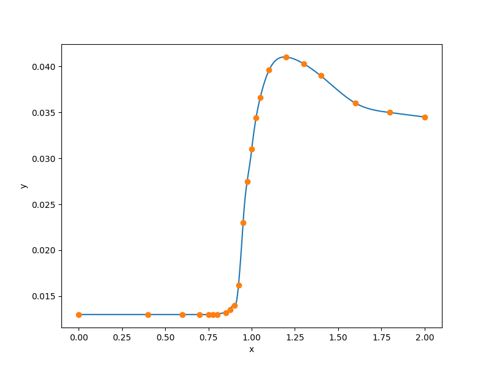

1-D step-like data set
======================

.. code-block:: python

  import numpy as np
  
  
  def get_one_d_step():
      xt = np.array(
          [
              0.0000,
              0.4000,
              0.6000,
              0.7000,
              0.7500,
              0.7750,
              0.8000,
              0.8500,
              0.8750,
              0.9000,
              0.9250,
              0.9500,
              0.9750,
              1.0000,
              1.0250,
              1.0500,
              1.1000,
              1.2000,
              1.3000,
              1.4000,
              1.6000,
              1.8000,
              2.0000,
          ],
          dtype=np.float64,
      )
      yt = np.array(
          [
              0.0130,
              0.0130,
              0.0130,
              0.0130,
              0.0130,
              0.0130,
              0.0130,
              0.0132,
              0.0135,
              0.0140,
              0.0162,
              0.0230,
              0.0275,
              0.0310,
              0.0344,
              0.0366,
              0.0396,
              0.0410,
              0.0403,
              0.0390,
              0.0360,
              0.0350,
              0.0345,
          ],
          dtype=np.float64,
      )
  
      xlimits = np.array([[0.0, 2.0]])
  
      return xt, yt, xlimits
  
  
  def plot_one_d_step(xt, yt, limits, interp):
      import numpy as np
      import matplotlib
  
      matplotlib.use("Agg")
      import matplotlib.pyplot as plt
  
      num = 500
      x = np.linspace(0.0, 2.0, num)
      y = interp.predict_values(x)[:, 0]
  
      plt.plot(x, y)
      plt.plot(xt, yt, "o")
      plt.xlabel("x")
      plt.ylabel("y")
      plt.show()
  

RMTB
----

.. code-block:: python

  from smt.surrogate_models import RMTB
  from smt.examples.one_D_step.one_D_step import get_one_d_step, plot_one_d_step
  
  xt, yt, xlimits = get_one_d_step()
  
  interp = RMTB(
      num_ctrl_pts=100,
      xlimits=xlimits,
      nonlinear_maxiter=20,
      solver_tolerance=1e-16,
      energy_weight=1e-14,
      regularization_weight=0.0,
  )
  interp.set_training_values(xt, yt)
  interp.train()
  
  plot_one_d_step(xt, yt, xlimits, interp)
  
::

  ___________________________________________________________________________
     
                                     RMTB
  ___________________________________________________________________________
     
   Problem size
     
        # training points.        : 23
     
  ___________________________________________________________________________
     
   Training
     
     Training ...
        Pre-computing matrices ...
           Computing dof2coeff ...
           Computing dof2coeff - done. Time (sec):  0.0000010
           Initializing Hessian ...
           Initializing Hessian - done. Time (sec):  0.0002089
           Computing energy terms ...
           Computing energy terms - done. Time (sec):  0.0006609
           Computing approximation terms ...
           Computing approximation terms - done. Time (sec):  0.0002170
        Pre-computing matrices - done. Time (sec):  0.0011098
        Solving for degrees of freedom ...
           Solving initial startup problem (n=100) ...
              Solving for output 0 ...
                 Iteration (num., iy, grad. norm, func.) :   0   0 1.032652876e-01 8.436300000e-03
                 Iteration (num., iy, grad. norm, func.) :   0   0 1.567421528e-08 2.220173969e-13
              Solving for output 0 - done. Time (sec):  0.0033522
           Solving initial startup problem (n=100) - done. Time (sec):  0.0033762
           Solving nonlinear problem (n=100) ...
              Solving for output 0 ...
                 Iteration (num., iy, grad. norm, func.) :   0   0 1.545444948e-11 2.217775376e-13
                 Iteration (num., iy, grad. norm, func.) :   0   0 1.391562145e-11 2.190138063e-13
                 Iteration (num., iy, grad. norm, func.) :   1   0 4.590598383e-10 1.413698668e-13
                 Iteration (num., iy, grad. norm, func.) :   2   0 3.075650146e-10 8.998276365e-14
                 Iteration (num., iy, grad. norm, func.) :   3   0 9.043817441e-11 2.372479307e-14
                 Iteration (num., iy, grad. norm, func.) :   4   0 4.296753808e-11 1.439889379e-14
                 Iteration (num., iy, grad. norm, func.) :   5   0 3.619158646e-11 1.347662737e-14
                 Iteration (num., iy, grad. norm, func.) :   6   0 1.052485610e-11 9.391523055e-15
                 Iteration (num., iy, grad. norm, func.) :   7   0 3.119795197e-12 8.642572960e-15
                 Iteration (num., iy, grad. norm, func.) :   8   0 8.975884595e-13 8.494201789e-15
                 Iteration (num., iy, grad. norm, func.) :   9   0 5.398174832e-13 8.476949277e-15
                 Iteration (num., iy, grad. norm, func.) :  10   0 1.627434616e-13 8.457663079e-15
                 Iteration (num., iy, grad. norm, func.) :  11   0 4.845584407e-14 8.454198324e-15
                 Iteration (num., iy, grad. norm, func.) :  12   0 1.660863912e-14 8.453536293e-15
                 Iteration (num., iy, grad. norm, func.) :  13   0 4.752821967e-15 8.453348906e-15
                 Iteration (num., iy, grad. norm, func.) :  14   0 2.812957629e-15 8.453292845e-15
                 Iteration (num., iy, grad. norm, func.) :  15   0 4.855261533e-15 8.453290247e-15
                 Iteration (num., iy, grad. norm, func.) :  16   0 1.013109582e-15 8.453271842e-15
                 Iteration (num., iy, grad. norm, func.) :  17   0 4.522465047e-16 8.453271818e-15
                 Iteration (num., iy, grad. norm, func.) :  18   0 9.554201199e-16 8.453271140e-15
                 Iteration (num., iy, grad. norm, func.) :  19   0 1.573641538e-16 8.453270913e-15
              Solving for output 0 - done. Time (sec):  0.0638521
           Solving nonlinear problem (n=100) - done. Time (sec):  0.0638709
        Solving for degrees of freedom - done. Time (sec):  0.0672708
     Training - done. Time (sec):  0.0685749
  ___________________________________________________________________________
     
   Evaluation
     
        # eval points. : 500
     
     Predicting ...
     Predicting - done. Time (sec):  0.0002246
     
     Prediction time/pt. (sec) :  0.0000004
     
  

RMTC
----

.. code-block:: python

  from smt.surrogate_models import RMTC
  from smt.examples.one_D_step.one_D_step import get_one_d_step, plot_one_d_step
  
  xt, yt, xlimits = get_one_d_step()
  
  interp = RMTC(
      num_elements=40,
      xlimits=xlimits,
      nonlinear_maxiter=20,
      solver_tolerance=1e-16,
      energy_weight=1e-14,
      regularization_weight=0.0,
  )
  interp.set_training_values(xt, yt)
  interp.train()
  
  plot_one_d_step(xt, yt, xlimits, interp)
  
::

  ___________________________________________________________________________
     
                                     RMTC
  ___________________________________________________________________________
     
   Problem size
     
        # training points.        : 23
     
  ___________________________________________________________________________
     
   Training
     
     Training ...
        Pre-computing matrices ...
           Computing dof2coeff ...
           Computing dof2coeff - done. Time (sec):  0.0004010
           Initializing Hessian ...
           Initializing Hessian - done. Time (sec):  0.0001700
           Computing energy terms ...
           Computing energy terms - done. Time (sec):  0.0007031
           Computing approximation terms ...
           Computing approximation terms - done. Time (sec):  0.0003028
        Pre-computing matrices - done. Time (sec):  0.0016010
        Solving for degrees of freedom ...
           Solving initial startup problem (n=82) ...
              Solving for output 0 ...
                 Iteration (num., iy, grad. norm, func.) :   0   0 1.470849329e-01 8.436300000e-03
                 Iteration (num., iy, grad. norm, func.) :   0   0 8.659433231e-11 2.493679177e-14
              Solving for output 0 - done. Time (sec):  0.0044467
           Solving initial startup problem (n=82) - done. Time (sec):  0.0044739
           Solving nonlinear problem (n=82) ...
              Solving for output 0 ...
                 Iteration (num., iy, grad. norm, func.) :   0   0 7.484130491e-12 2.493672118e-14
                 Iteration (num., iy, grad. norm, func.) :   0   0 9.032445735e-12 2.483305813e-14
                 Iteration (num., iy, grad. norm, func.) :   1   0 8.870504089e-11 2.410775250e-14
                 Iteration (num., iy, grad. norm, func.) :   2   0 8.810713985e-11 2.314863921e-14
                 Iteration (num., iy, grad. norm, func.) :   3   0 2.585648570e-11 1.330142817e-14
                 Iteration (num., iy, grad. norm, func.) :   4   0 1.363154521e-11 1.207280407e-14
                 Iteration (num., iy, grad. norm, func.) :   5   0 3.836622245e-12 1.124826068e-14
                 Iteration (num., iy, grad. norm, func.) :   6   0 1.119634533e-12 1.111962561e-14
                 Iteration (num., iy, grad. norm, func.) :   7   0 3.555841788e-13 1.109646294e-14
                 Iteration (num., iy, grad. norm, func.) :   8   0 1.043349923e-13 1.109071196e-14
                 Iteration (num., iy, grad. norm, func.) :   9   0 2.987266066e-14 1.108962732e-14
                 Iteration (num., iy, grad. norm, func.) :  10   0 7.982267083e-15 1.108943595e-14
                 Iteration (num., iy, grad. norm, func.) :  11   0 1.900305680e-15 1.108940775e-14
                 Iteration (num., iy, grad. norm, func.) :  12   0 4.928167944e-16 1.108940411e-14
                 Iteration (num., iy, grad. norm, func.) :  13   0 7.341931424e-16 1.108940372e-14
                 Iteration (num., iy, grad. norm, func.) :  14   0 4.098180247e-17 1.108940340e-14
              Solving for output 0 - done. Time (sec):  0.0514600
           Solving nonlinear problem (n=82) - done. Time (sec):  0.0514817
        Solving for degrees of freedom - done. Time (sec):  0.0559831
     Training - done. Time (sec):  0.0577860
  ___________________________________________________________________________
     
   Evaluation
     
        # eval points. : 500
     
     Predicting ...
     Predicting - done. Time (sec):  0.0002460
     
     Prediction time/pt. (sec) :  0.0000005
     
  

