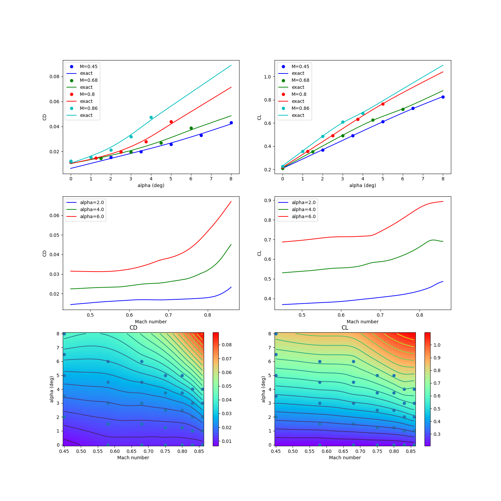

RANS CRM wing 2-D data set
==========================

.. code-block:: python

  import numpy as np
  
  
  raw = np.array(
      [
          [
              2.000000000000000000e00,
              4.500000000000000111e-01,
              1.536799999999999972e-02,
              3.674239999999999728e-01,
              5.592279999999999474e-01,
              -1.258039999999999992e-01,
              -1.248699999999999984e-02,
          ],
          [
              3.500000000000000000e00,
              4.500000000000000111e-01,
              1.985100000000000059e-02,
              4.904470000000000218e-01,
              7.574600000000000222e-01,
              -1.615260000000000029e-01,
              8.987000000000000197e-03,
          ],
          [
              5.000000000000000000e00,
              4.500000000000000111e-01,
              2.571000000000000021e-02,
              6.109189999999999898e-01,
              9.497949999999999449e-01,
              -1.954619999999999969e-01,
              4.090900000000000092e-02,
          ],
          [
              6.500000000000000000e00,
              4.500000000000000111e-01,
              3.304200000000000192e-02,
              7.266120000000000356e-01,
              1.131138999999999895e00,
              -2.255890000000000117e-01,
              8.185399999999999621e-02,
          ],
          [
              8.000000000000000000e00,
              4.500000000000000111e-01,
              4.318999999999999923e-02,
              8.247250000000000414e-01,
              1.271487000000000034e00,
              -2.397040000000000004e-01,
              1.217659999999999992e-01,
          ],
          [
              0.000000000000000000e00,
              5.799999999999999600e-01,
              1.136200000000000057e-02,
              2.048760000000000026e-01,
              2.950280000000000125e-01,
              -7.882100000000000217e-02,
              -2.280099999999999835e-02,
          ],
          [
              1.500000000000000000e00,
              5.799999999999999600e-01,
              1.426000000000000011e-02,
              3.375619999999999732e-01,
              5.114130000000000065e-01,
              -1.189420000000000061e-01,
              -1.588200000000000028e-02,
          ],
          [
              3.000000000000000000e00,
              5.799999999999999600e-01,
              1.866400000000000003e-02,
              4.687450000000000228e-01,
              7.240400000000000169e-01,
              -1.577669999999999906e-01,
              3.099999999999999891e-03,
          ],
          [
              4.500000000000000000e00,
              5.799999999999999600e-01,
              2.461999999999999952e-02,
              5.976639999999999731e-01,
              9.311709999999999710e-01,
              -1.944160000000000055e-01,
              3.357500000000000068e-02,
          ],
          [
              6.000000000000000000e00,
              5.799999999999999600e-01,
              3.280700000000000283e-02,
              7.142249999999999988e-01,
              1.111707999999999918e00,
              -2.205870000000000053e-01,
              7.151699999999999724e-02,
          ],
          [
              0.000000000000000000e00,
              6.800000000000000488e-01,
              1.138800000000000055e-02,
              2.099310000000000065e-01,
              3.032230000000000203e-01,
              -8.187899999999999345e-02,
              -2.172699999999999979e-02,
          ],
          [
              1.500000000000000000e00,
              6.800000000000000488e-01,
              1.458699999999999927e-02,
              3.518569999999999753e-01,
              5.356630000000000003e-01,
              -1.257649999999999879e-01,
              -1.444800000000000077e-02,
          ],
          [
              3.000000000000000000e00,
              6.800000000000000488e-01,
              1.952800000000000022e-02,
              4.924879999999999813e-01,
              7.644769999999999621e-01,
              -1.678040000000000087e-01,
              6.023999999999999841e-03,
          ],
          [
              4.500000000000000000e00,
              6.800000000000000488e-01,
              2.666699999999999973e-02,
              6.270339999999999803e-01,
              9.801630000000000065e-01,
              -2.035240000000000105e-01,
              3.810000000000000192e-02,
          ],
          [
              6.000000000000000000e00,
              6.800000000000000488e-01,
              3.891800000000000120e-02,
              7.172730000000000494e-01,
              1.097855999999999943e00,
              -2.014620000000000022e-01,
              6.640000000000000069e-02,
          ],
          [
              0.000000000000000000e00,
              7.500000000000000000e-01,
              1.150699999999999987e-02,
              2.149069999999999869e-01,
              3.115740000000000176e-01,
              -8.498999999999999611e-02,
              -2.057700000000000154e-02,
          ],
          [
              1.250000000000000000e00,
              7.500000000000000000e-01,
              1.432600000000000019e-02,
              3.415969999999999840e-01,
              5.199390000000000400e-01,
              -1.251009999999999900e-01,
              -1.515400000000000080e-02,
          ],
          [
              2.500000000000000000e00,
              7.500000000000000000e-01,
              1.856000000000000011e-02,
              4.677589999999999804e-01,
              7.262499999999999512e-01,
              -1.635169999999999957e-01,
              3.989999999999999949e-04,
          ],
          [
              3.750000000000000000e00,
              7.500000000000000000e-01,
              2.472399999999999945e-02,
              5.911459999999999493e-01,
              9.254930000000000101e-01,
              -1.966150000000000120e-01,
              2.524900000000000061e-02,
          ],
          [
              5.000000000000000000e00,
              7.500000000000000000e-01,
              3.506800000000000195e-02,
              7.047809999999999908e-01,
              1.097736000000000045e00,
              -2.143069999999999975e-01,
              5.321300000000000335e-02,
          ],
          [
              0.000000000000000000e00,
              8.000000000000000444e-01,
              1.168499999999999921e-02,
              2.196390000000000009e-01,
              3.197160000000000002e-01,
              -8.798200000000000465e-02,
              -1.926999999999999894e-02,
          ],
          [
              1.250000000000000000e00,
              8.000000000000000444e-01,
              1.481599999999999931e-02,
              3.553939999999999877e-01,
              5.435950000000000504e-01,
              -1.317419999999999980e-01,
              -1.345599999999999921e-02,
          ],
          [
              2.500000000000000000e00,
              8.000000000000000444e-01,
              1.968999999999999917e-02,
              4.918299999999999894e-01,
              7.669930000000000359e-01,
              -1.728079999999999894e-01,
              3.756999999999999923e-03,
          ],
          [
              3.750000000000000000e00,
              8.000000000000000444e-01,
              2.785599999999999882e-02,
              6.324319999999999942e-01,
              9.919249999999999456e-01,
              -2.077100000000000057e-01,
              3.159800000000000109e-02,
          ],
          [
              5.000000000000000000e00,
              8.000000000000000444e-01,
              4.394300000000000289e-02,
              7.650689999999999991e-01,
              1.188355999999999968e00,
              -2.332680000000000031e-01,
              5.645000000000000018e-02,
          ],
          [
              0.000000000000000000e00,
              8.299999999999999600e-01,
              1.186100000000000002e-02,
              2.232899999999999885e-01,
              3.261100000000000110e-01,
              -9.028400000000000314e-02,
              -1.806500000000000120e-02,
          ],
          [
              1.000000000000000000e00,
              8.299999999999999600e-01,
              1.444900000000000004e-02,
              3.383419999999999761e-01,
              5.161710000000000464e-01,
              -1.279530000000000112e-01,
              -1.402400000000000001e-02,
          ],
          [
              2.000000000000000000e00,
              8.299999999999999600e-01,
              1.836799999999999891e-02,
              4.554270000000000262e-01,
              7.082190000000000429e-01,
              -1.642339999999999911e-01,
              -1.793000000000000106e-03,
          ],
          [
              3.000000000000000000e00,
              8.299999999999999600e-01,
              2.466899999999999996e-02,
              5.798410000000000508e-01,
              9.088819999999999677e-01,
              -2.004589999999999983e-01,
              1.892900000000000138e-02,
          ],
          [
              4.000000000000000000e00,
              8.299999999999999600e-01,
              3.700400000000000217e-02,
              7.012720000000000065e-01,
              1.097366000000000064e00,
              -2.362420000000000075e-01,
              3.750699999999999867e-02,
          ],
          [
              0.000000000000000000e00,
              8.599999999999999867e-01,
              1.224300000000000041e-02,
              2.278100000000000125e-01,
              3.342720000000000136e-01,
              -9.307600000000000595e-02,
              -1.608400000000000107e-02,
          ],
          [
              1.000000000000000000e00,
              8.599999999999999867e-01,
              1.540700000000000056e-02,
              3.551839999999999997e-01,
              5.433130000000000459e-01,
              -1.364730000000000110e-01,
              -1.162200000000000039e-02,
          ],
          [
              2.000000000000000000e00,
              8.599999999999999867e-01,
              2.122699999999999934e-02,
              4.854620000000000046e-01,
              7.552919999999999634e-01,
              -1.817850000000000021e-01,
              1.070999999999999903e-03,
          ],
          [
              3.000000000000000000e00,
              8.599999999999999867e-01,
              3.178899999999999781e-02,
              6.081849999999999756e-01,
              9.510380000000000500e-01,
              -2.252020000000000133e-01,
              1.540799999999999982e-02,
          ],
          [
              4.000000000000000000e00,
              8.599999999999999867e-01,
              4.744199999999999806e-02,
              6.846989999999999466e-01,
              1.042564000000000046e00,
              -2.333600000000000119e-01,
              2.035400000000000056e-02,
          ],
      ]
  )
  
  
  def get_rans_crm_wing():
      # data structure:
      # alpha, mach, cd, cl, cmx, cmy, cmz
  
      deg2rad = np.pi / 180.0
  
      xt = np.array(raw[:, 0:2])
      yt = np.array(raw[:, 2:4])
      xlimits = np.array([[-3.0, 10.0], [0.4, 0.90]])
  
      xt[:, 0] *= deg2rad
      xlimits[0, :] *= deg2rad
  
      return xt, yt, xlimits
  
  
  def plot_rans_crm_wing(xt, yt, limits, interp):
      import numpy as np
      import matplotlib
  
      matplotlib.use("Agg")
      import matplotlib.pyplot as plt
  
      rad2deg = 180.0 / np.pi
  
      num = 500
      num_a = 50
      num_M = 50
  
      x = np.zeros((num, 2))
      colors = ["b", "g", "r", "c", "m", "k", "y"]
  
      nrow = 3
      ncol = 2
  
      plt.close()
      fig, axs = plt.subplots(3, 2, figsize=(15, 15))
  
      # -----------------------------------------------------------------------------
  
      mach_numbers = [0.45, 0.68, 0.80, 0.86]
      legend_entries = []
  
      alpha_sweep = np.linspace(0.0, 8.0, num)
  
      for ind, mach in enumerate(mach_numbers):
          x[:, 0] = alpha_sweep / rad2deg
          x[:, 1] = mach
          CD = interp.predict_values(x)[:, 0]
          CL = interp.predict_values(x)[:, 1]
  
          mask = np.abs(xt[:, 1] - mach) < 1e-10
          axs[0, 0].plot(xt[mask, 0] * rad2deg, yt[mask, 0], "o" + colors[ind])
          axs[0, 0].plot(alpha_sweep, CD, colors[ind])
  
          mask = np.abs(xt[:, 1] - mach) < 1e-10
          axs[0, 1].plot(xt[mask, 0] * rad2deg, yt[mask, 1], "o" + colors[ind])
          axs[0, 1].plot(alpha_sweep, CL, colors[ind])
  
          legend_entries.append("M={}".format(mach))
          legend_entries.append("exact")
  
      axs[0, 0].set(xlabel="alpha (deg)", ylabel="CD")
      axs[0, 0].legend(legend_entries)
  
      axs[0, 1].set(xlabel="alpha (deg)", ylabel="CL")
      axs[0, 1].legend(legend_entries)
  
      # -----------------------------------------------------------------------------
  
      alphas = [2.0, 4.0, 6.0]
      legend_entries = []
  
      mach_sweep = np.linspace(0.45, 0.86, num)
  
      for ind, alpha in enumerate(alphas):
          x[:, 0] = alpha / rad2deg
          x[:, 1] = mach_sweep
          CD = interp.predict_values(x)[:, 0]
          CL = interp.predict_values(x)[:, 1]
  
          axs[1, 0].plot(mach_sweep, CD, colors[ind])
          axs[1, 1].plot(mach_sweep, CL, colors[ind])
  
          legend_entries.append("alpha={}".format(alpha))
  
      axs[1, 0].set(xlabel="Mach number", ylabel="CD")
      axs[1, 0].legend(legend_entries)
  
      axs[1, 1].set(xlabel="Mach number", ylabel="CL")
      axs[1, 1].legend(legend_entries)
  
      # -----------------------------------------------------------------------------
  
      x = np.zeros((num_a, num_M, 2))
      x[:, :, 0] = np.outer(np.linspace(0.0, 8.0, num_a), np.ones(num_M)) / rad2deg
      x[:, :, 1] = np.outer(np.ones(num_a), np.linspace(0.45, 0.86, num_M))
      CD = interp.predict_values(x.reshape((num_a * num_M, 2)))[:, 0].reshape(
          (num_a, num_M)
      )
      CL = interp.predict_values(x.reshape((num_a * num_M, 2)))[:, 1].reshape(
          (num_a, num_M)
      )
  
      axs[2, 0].plot(xt[:, 1], xt[:, 0] * rad2deg, "o")
      axs[2, 0].contour(x[:, :, 1], x[:, :, 0] * rad2deg, CD, 20)
      pcm1 = axs[2, 0].pcolormesh(
          x[:, :, 1],
          x[:, :, 0] * rad2deg,
          CD,
          cmap=plt.get_cmap("rainbow"),
          shading="auto",
      )
      fig.colorbar(pcm1, ax=axs[2, 0])
      axs[2, 0].set(xlabel="Mach number", ylabel="alpha (deg)")
      axs[2, 0].set_title("CD")
  
      axs[2, 1].plot(xt[:, 1], xt[:, 0] * rad2deg, "o")
      axs[2, 1].contour(x[:, :, 1], x[:, :, 0] * rad2deg, CL, 20)
      pcm2 = axs[2, 1].pcolormesh(
          x[:, :, 1],
          x[:, :, 0] * rad2deg,
          CL,
          cmap=plt.get_cmap("rainbow"),
          shading="auto",
      )
      fig.colorbar(pcm2, ax=axs[2, 1])
      axs[2, 1].set(xlabel="Mach number", ylabel="alpha (deg)")
      axs[2, 1].set_title("CL")
  
      plt.show()
  

RMTB
----

.. code-block:: python

  from smt.surrogate_models import RMTB
  from smt.examples.rans_crm_wing.rans_crm_wing import (
      get_rans_crm_wing,
      plot_rans_crm_wing,
  )
  
  xt, yt, xlimits = get_rans_crm_wing()
  
  interp = RMTB(
      num_ctrl_pts=20, xlimits=xlimits, nonlinear_maxiter=100, energy_weight=1e-12
  )
  interp.set_training_values(xt, yt)
  interp.train()
  
  plot_rans_crm_wing(xt, yt, xlimits, interp)
  
::

  ___________________________________________________________________________
     
                                     RMTB
  ___________________________________________________________________________
     
   Problem size
     
        # training points.        : 35
     
  ___________________________________________________________________________
     
   Training
     
     Training ...
        Pre-computing matrices ...
           Computing dof2coeff ...
           Computing dof2coeff - done. Time (sec):  0.0000021
           Initializing Hessian ...
           Initializing Hessian - done. Time (sec):  0.0002329
           Computing energy terms ...
           Computing energy terms - done. Time (sec):  0.0027292
           Computing approximation terms ...
           Computing approximation terms - done. Time (sec):  0.0002260
        Pre-computing matrices - done. Time (sec):  0.0032136
        Solving for degrees of freedom ...
           Solving initial startup problem (n=400) ...
              Solving for output 0 ...
                 Iteration (num., iy, grad. norm, func.) :   0   0 9.429150220e-02 1.114942861e-02
                 Iteration (num., iy, grad. norm, func.) :   0   0 1.092246996e-07 1.793292065e-10
              Solving for output 0 - done. Time (sec):  0.0054898
              Solving for output 1 ...
                 Iteration (num., iy, grad. norm, func.) :   0   1 1.955493282e+00 4.799845498e+00
                 Iteration (num., iy, grad. norm, func.) :   0   1 1.126918432e-06 4.567804775e-08
              Solving for output 1 - done. Time (sec):  0.0053887
           Solving initial startup problem (n=400) - done. Time (sec):  0.0109081
           Solving nonlinear problem (n=400) ...
              Solving for output 0 ...
                 Iteration (num., iy, grad. norm, func.) :   0   0 6.649541383e-09 1.793040779e-10
                 Iteration (num., iy, grad. norm, func.) :   0   0 5.846446541e-09 1.703974433e-10
                 Iteration (num., iy, grad. norm, func.) :   1   0 3.037728019e-08 1.036348892e-10
                 Iteration (num., iy, grad. norm, func.) :   2   0 1.142669725e-08 2.546088529e-11
                 Iteration (num., iy, grad. norm, func.) :   3   0 3.456415875e-09 1.035198930e-11
                 Iteration (num., iy, grad. norm, func.) :   4   0 2.377812238e-09 9.357641472e-12
                 Iteration (num., iy, grad. norm, func.) :   5   0 6.790956859e-10 7.407551084e-12
                 Iteration (num., iy, grad. norm, func.) :   6   0 1.907931876e-10 6.536447681e-12
                 Iteration (num., iy, grad. norm, func.) :   7   0 3.911322001e-11 6.262492736e-12
                 Iteration (num., iy, grad. norm, func.) :   8   0 2.434809729e-11 6.261300779e-12
                 Iteration (num., iy, grad. norm, func.) :   9   0 1.471045589e-11 6.260673511e-12
                 Iteration (num., iy, grad. norm, func.) :  10   0 1.362709305e-11 6.260631433e-12
                 Iteration (num., iy, grad. norm, func.) :  11   0 3.286340010e-12 6.256822140e-12
                 Iteration (num., iy, grad. norm, func.) :  12   0 5.260027991e-13 6.255691629e-12
              Solving for output 0 - done. Time (sec):  0.0687590
              Solving for output 1 ...
                 Iteration (num., iy, grad. norm, func.) :   0   1 9.728108705e-08 4.567641928e-08
                 Iteration (num., iy, grad. norm, func.) :   0   1 9.336546293e-08 4.538206961e-08
                 Iteration (num., iy, grad. norm, func.) :   1   1 2.895927675e-06 3.244386400e-08
                 Iteration (num., iy, grad. norm, func.) :   2   1 8.583553009e-07 4.636748194e-09
                 Iteration (num., iy, grad. norm, func.) :   3   1 3.380748922e-07 2.510256576e-09
                 Iteration (num., iy, grad. norm, func.) :   4   1 2.808973893e-07 2.022967576e-09
                 Iteration (num., iy, grad. norm, func.) :   5   1 1.344726584e-07 9.629484319e-10
                 Iteration (num., iy, grad. norm, func.) :   6   1 4.211801822e-08 5.644138519e-10
                 Iteration (num., iy, grad. norm, func.) :   7   1 1.322090475e-08 5.314365287e-10
                 Iteration (num., iy, grad. norm, func.) :   8   1 5.026687694e-09 4.160820088e-10
                 Iteration (num., iy, grad. norm, func.) :   9   1 1.509447245e-09 3.120315101e-10
                 Iteration (num., iy, grad. norm, func.) :  10   1 4.281365661e-10 2.729887781e-10
                 Iteration (num., iy, grad. norm, func.) :  11   1 4.549244045e-10 2.726820554e-10
                 Iteration (num., iy, grad. norm, func.) :  12   1 3.679991917e-10 2.724670055e-10
                 Iteration (num., iy, grad. norm, func.) :  13   1 2.587733606e-10 2.724463703e-10
                 Iteration (num., iy, grad. norm, func.) :  14   1 3.947116462e-10 2.721858145e-10
                 Iteration (num., iy, grad. norm, func.) :  15   1 1.224728194e-10 2.715200759e-10
                 Iteration (num., iy, grad. norm, func.) :  16   1 3.675057587e-11 2.714139623e-10
                 Iteration (num., iy, grad. norm, func.) :  17   1 2.669085957e-11 2.713914769e-10
                 Iteration (num., iy, grad. norm, func.) :  18   1 3.131059548e-11 2.713858747e-10
                 Iteration (num., iy, grad. norm, func.) :  19   1 2.813543208e-11 2.713714225e-10
                 Iteration (num., iy, grad. norm, func.) :  20   1 1.048041746e-11 2.713551426e-10
                 Iteration (num., iy, grad. norm, func.) :  21   1 1.136281320e-11 2.713502720e-10
                 Iteration (num., iy, grad. norm, func.) :  22   1 1.119851405e-11 2.713479359e-10
                 Iteration (num., iy, grad. norm, func.) :  23   1 8.238182419e-12 2.713472788e-10
                 Iteration (num., iy, grad. norm, func.) :  24   1 3.740443314e-12 2.713461506e-10
                 Iteration (num., iy, grad. norm, func.) :  25   1 3.281053382e-12 2.713454588e-10
                 Iteration (num., iy, grad. norm, func.) :  26   1 3.732457313e-12 2.713452523e-10
                 Iteration (num., iy, grad. norm, func.) :  27   1 2.205608627e-12 2.713452229e-10
                 Iteration (num., iy, grad. norm, func.) :  28   1 1.582773243e-12 2.713451089e-10
                 Iteration (num., iy, grad. norm, func.) :  29   1 1.579418464e-12 2.713449834e-10
                 Iteration (num., iy, grad. norm, func.) :  30   1 4.748057407e-13 2.713449413e-10
              Solving for output 1 - done. Time (sec):  0.1636322
           Solving nonlinear problem (n=400) - done. Time (sec):  0.2324140
        Solving for degrees of freedom - done. Time (sec):  0.2433488
     Training - done. Time (sec):  0.2467768
  ___________________________________________________________________________
     
   Evaluation
     
        # eval points. : 500
     
     Predicting ...
     Predicting - done. Time (sec):  0.0003281
     
     Prediction time/pt. (sec) :  0.0000007
     
  ___________________________________________________________________________
     
   Evaluation
     
        # eval points. : 500
     
     Predicting ...
     Predicting - done. Time (sec):  0.0002499
     
     Prediction time/pt. (sec) :  0.0000005
     
  ___________________________________________________________________________
     
   Evaluation
     
        # eval points. : 500
     
     Predicting ...
     Predicting - done. Time (sec):  0.0002861
     
     Prediction time/pt. (sec) :  0.0000006
     
  ___________________________________________________________________________
     
   Evaluation
     
        # eval points. : 500
     
     Predicting ...
     Predicting - done. Time (sec):  0.0002871
     
     Prediction time/pt. (sec) :  0.0000006
     
  ___________________________________________________________________________
     
   Evaluation
     
        # eval points. : 500
     
     Predicting ...
     Predicting - done. Time (sec):  0.0002708
     
     Prediction time/pt. (sec) :  0.0000005
     
  ___________________________________________________________________________
     
   Evaluation
     
        # eval points. : 500
     
     Predicting ...
     Predicting - done. Time (sec):  0.0002358
     
     Prediction time/pt. (sec) :  0.0000005
     
  ___________________________________________________________________________
     
   Evaluation
     
        # eval points. : 500
     
     Predicting ...
     Predicting - done. Time (sec):  0.0002751
     
     Prediction time/pt. (sec) :  0.0000006
     
  ___________________________________________________________________________
     
   Evaluation
     
        # eval points. : 500
     
     Predicting ...
     Predicting - done. Time (sec):  0.0002520
     
     Prediction time/pt. (sec) :  0.0000005
     
  ___________________________________________________________________________
     
   Evaluation
     
        # eval points. : 500
     
     Predicting ...
     Predicting - done. Time (sec):  0.0003011
     
     Prediction time/pt. (sec) :  0.0000006
     
  ___________________________________________________________________________
     
   Evaluation
     
        # eval points. : 500
     
     Predicting ...
     Predicting - done. Time (sec):  0.0002499
     
     Prediction time/pt. (sec) :  0.0000005
     
  ___________________________________________________________________________
     
   Evaluation
     
        # eval points. : 500
     
     Predicting ...
     Predicting - done. Time (sec):  0.0002749
     
     Prediction time/pt. (sec) :  0.0000005
     
  ___________________________________________________________________________
     
   Evaluation
     
        # eval points. : 500
     
     Predicting ...
     Predicting - done. Time (sec):  0.0002580
     
     Prediction time/pt. (sec) :  0.0000005
     
  ___________________________________________________________________________
     
   Evaluation
     
        # eval points. : 500
     
     Predicting ...
     Predicting - done. Time (sec):  0.0002649
     
     Prediction time/pt. (sec) :  0.0000005
     
  ___________________________________________________________________________
     
   Evaluation
     
        # eval points. : 500
     
     Predicting ...
     Predicting - done. Time (sec):  0.0002389
     
     Prediction time/pt. (sec) :  0.0000005
     
  ___________________________________________________________________________
     
   Evaluation
     
        # eval points. : 2500
     
     Predicting ...
     Predicting - done. Time (sec):  0.0008130
     
     Prediction time/pt. (sec) :  0.0000003
     
  ___________________________________________________________________________
     
   Evaluation
     
        # eval points. : 2500
     
     Predicting ...
     Predicting - done. Time (sec):  0.0007579
     
     Prediction time/pt. (sec) :  0.0000003
     
  

RMTC
----

.. code-block:: python

  from smt.surrogate_models import RMTC
  from smt.examples.rans_crm_wing.rans_crm_wing import (
      get_rans_crm_wing,
      plot_rans_crm_wing,
  )
  
  xt, yt, xlimits = get_rans_crm_wing()
  
  interp = RMTC(
      num_elements=20, xlimits=xlimits, nonlinear_maxiter=100, energy_weight=1e-10
  )
  interp.set_training_values(xt, yt)
  interp.train()
  
  plot_rans_crm_wing(xt, yt, xlimits, interp)
  
::

  ___________________________________________________________________________
     
                                     RMTC
  ___________________________________________________________________________
     
   Problem size
     
        # training points.        : 35
     
  ___________________________________________________________________________
     
   Training
     
     Training ...
        Pre-computing matrices ...
           Computing dof2coeff ...
           Computing dof2coeff - done. Time (sec):  0.0019219
           Initializing Hessian ...
           Initializing Hessian - done. Time (sec):  0.0001719
           Computing energy terms ...
           Computing energy terms - done. Time (sec):  0.0087290
           Computing approximation terms ...
           Computing approximation terms - done. Time (sec):  0.0010121
        Pre-computing matrices - done. Time (sec):  0.0118771
        Solving for degrees of freedom ...
           Solving initial startup problem (n=1764) ...
              Solving for output 0 ...
                 Iteration (num., iy, grad. norm, func.) :   0   0 1.279175539e-01 1.114942861e-02
                 Iteration (num., iy, grad. norm, func.) :   0   0 2.562498504e-06 2.207651794e-08
              Solving for output 0 - done. Time (sec):  0.0209241
              Solving for output 1 ...
                 Iteration (num., iy, grad. norm, func.) :   0   1 2.653045755e+00 4.799845498e+00
                 Iteration (num., iy, grad. norm, func.) :   0   1 3.758521031e-05 6.503613932e-06
              Solving for output 1 - done. Time (sec):  0.0217302
           Solving initial startup problem (n=1764) - done. Time (sec):  0.0427299
           Solving nonlinear problem (n=1764) ...
              Solving for output 0 ...
                 Iteration (num., iy, grad. norm, func.) :   0   0 8.741139606e-07 2.207210193e-08
                 Iteration (num., iy, grad. norm, func.) :   0   0 9.585969046e-07 1.752455286e-08
                 Iteration (num., iy, grad. norm, func.) :   1   0 3.549219471e-07 3.273432622e-09
                 Iteration (num., iy, grad. norm, func.) :   2   0 1.183252926e-07 1.053106736e-09
                 Iteration (num., iy, grad. norm, func.) :   3   0 6.341593935e-08 5.347528791e-10
                 Iteration (num., iy, grad. norm, func.) :   4   0 3.374262965e-08 4.103919269e-10
                 Iteration (num., iy, grad. norm, func.) :   5   0 2.246498474e-08 3.752799037e-10
                 Iteration (num., iy, grad. norm, func.) :   6   0 1.966821325e-08 3.750859712e-10
                 Iteration (num., iy, grad. norm, func.) :   7   0 1.527816846e-08 3.661070502e-10
                 Iteration (num., iy, grad. norm, func.) :   8   0 1.694956711e-08 3.641443514e-10
                 Iteration (num., iy, grad. norm, func.) :   9   0 1.395756787e-08 3.400028713e-10
                 Iteration (num., iy, grad. norm, func.) :  10   0 8.631569187e-09 3.088307254e-10
                 Iteration (num., iy, grad. norm, func.) :  11   0 2.738831017e-09 2.905766862e-10
                 Iteration (num., iy, grad. norm, func.) :  12   0 2.430575636e-09 2.894126790e-10
                 Iteration (num., iy, grad. norm, func.) :  13   0 2.430575633e-09 2.894126790e-10
                 Iteration (num., iy, grad. norm, func.) :  14   0 2.430575633e-09 2.894126790e-10
                 Iteration (num., iy, grad. norm, func.) :  15   0 3.824316371e-09 2.884226353e-10
                 Iteration (num., iy, grad. norm, func.) :  16   0 7.520858016e-10 2.872923286e-10
                 Iteration (num., iy, grad. norm, func.) :  17   0 1.436421632e-09 2.870607979e-10
                 Iteration (num., iy, grad. norm, func.) :  18   0 9.955945437e-10 2.869810119e-10
                 Iteration (num., iy, grad. norm, func.) :  19   0 9.463481046e-10 2.869601083e-10
                 Iteration (num., iy, grad. norm, func.) :  20   0 8.773651337e-10 2.869013244e-10
                 Iteration (num., iy, grad. norm, func.) :  21   0 1.073939637e-09 2.867519090e-10
                 Iteration (num., iy, grad. norm, func.) :  22   0 7.080258937e-10 2.866268246e-10
                 Iteration (num., iy, grad. norm, func.) :  23   0 3.605596770e-10 2.865654579e-10
                 Iteration (num., iy, grad. norm, func.) :  24   0 3.088592650e-10 2.865629643e-10
                 Iteration (num., iy, grad. norm, func.) :  25   0 4.451050200e-10 2.865623573e-10
                 Iteration (num., iy, grad. norm, func.) :  26   0 3.629304622e-10 2.865538718e-10
                 Iteration (num., iy, grad. norm, func.) :  27   0 4.874787144e-10 2.865434590e-10
                 Iteration (num., iy, grad. norm, func.) :  28   0 2.488295767e-10 2.865288527e-10
                 Iteration (num., iy, grad. norm, func.) :  29   0 3.296840642e-10 2.865203739e-10
                 Iteration (num., iy, grad. norm, func.) :  30   0 1.809795916e-10 2.865128414e-10
                 Iteration (num., iy, grad. norm, func.) :  31   0 2.752697409e-10 2.865062829e-10
                 Iteration (num., iy, grad. norm, func.) :  32   0 8.861408851e-11 2.864997288e-10
                 Iteration (num., iy, grad. norm, func.) :  33   0 8.178183786e-11 2.864993297e-10
                 Iteration (num., iy, grad. norm, func.) :  34   0 1.310197420e-10 2.864991602e-10
                 Iteration (num., iy, grad. norm, func.) :  35   0 1.412809461e-10 2.864980898e-10
                 Iteration (num., iy, grad. norm, func.) :  36   0 1.251847641e-10 2.864969247e-10
                 Iteration (num., iy, grad. norm, func.) :  37   0 8.051528115e-11 2.864953403e-10
                 Iteration (num., iy, grad. norm, func.) :  38   0 8.053046418e-11 2.864948612e-10
                 Iteration (num., iy, grad. norm, func.) :  39   0 8.181306323e-11 2.864945306e-10
                 Iteration (num., iy, grad. norm, func.) :  40   0 6.072167275e-11 2.864941454e-10
                 Iteration (num., iy, grad. norm, func.) :  41   0 6.772075264e-11 2.864938083e-10
                 Iteration (num., iy, grad. norm, func.) :  42   0 4.499006001e-11 2.864934422e-10
                 Iteration (num., iy, grad. norm, func.) :  43   0 6.432837978e-11 2.864929573e-10
                 Iteration (num., iy, grad. norm, func.) :  44   0 1.533868422e-11 2.864926220e-10
                 Iteration (num., iy, grad. norm, func.) :  45   0 1.262749741e-11 2.864926196e-10
                 Iteration (num., iy, grad. norm, func.) :  46   0 1.778828478e-11 2.864925983e-10
                 Iteration (num., iy, grad. norm, func.) :  47   0 1.941315096e-11 2.864925634e-10
                 Iteration (num., iy, grad. norm, func.) :  48   0 2.152462936e-11 2.864925314e-10
                 Iteration (num., iy, grad. norm, func.) :  49   0 1.599515064e-11 2.864924983e-10
                 Iteration (num., iy, grad. norm, func.) :  50   0 1.188532028e-11 2.864924895e-10
                 Iteration (num., iy, grad. norm, func.) :  51   0 1.168759536e-11 2.864924744e-10
                 Iteration (num., iy, grad. norm, func.) :  52   0 1.051683872e-11 2.864924579e-10
                 Iteration (num., iy, grad. norm, func.) :  53   0 1.011757562e-11 2.864924433e-10
                 Iteration (num., iy, grad. norm, func.) :  54   0 4.444789384e-12 2.864924320e-10
                 Iteration (num., iy, grad. norm, func.) :  55   0 4.013663792e-12 2.864924309e-10
                 Iteration (num., iy, grad. norm, func.) :  56   0 6.667370751e-12 2.864924301e-10
                 Iteration (num., iy, grad. norm, func.) :  57   0 5.116596354e-12 2.864924276e-10
                 Iteration (num., iy, grad. norm, func.) :  58   0 7.280805312e-12 2.864924222e-10
                 Iteration (num., iy, grad. norm, func.) :  59   0 1.588105840e-12 2.864924176e-10
                 Iteration (num., iy, grad. norm, func.) :  60   0 1.075348156e-12 2.864924175e-10
                 Iteration (num., iy, grad. norm, func.) :  61   0 1.476643836e-12 2.864924173e-10
                 Iteration (num., iy, grad. norm, func.) :  62   0 2.506316629e-12 2.864924172e-10
                 Iteration (num., iy, grad. norm, func.) :  63   0 1.943242105e-12 2.864924171e-10
                 Iteration (num., iy, grad. norm, func.) :  64   0 2.333306938e-12 2.864924170e-10
                 Iteration (num., iy, grad. norm, func.) :  65   0 2.243954402e-12 2.864924166e-10
                 Iteration (num., iy, grad. norm, func.) :  66   0 9.497582218e-13 2.864924161e-10
              Solving for output 0 - done. Time (sec):  1.1166191
              Solving for output 1 ...
                 Iteration (num., iy, grad. norm, func.) :   0   1 1.437592454e-05 6.502610449e-06
                 Iteration (num., iy, grad. norm, func.) :   0   1 1.437263026e-05 6.255383629e-06
                 Iteration (num., iy, grad. norm, func.) :   1   1 1.484484861e-05 8.067156409e-07
                 Iteration (num., iy, grad. norm, func.) :   2   1 1.866946643e-05 3.749685291e-07
                 Iteration (num., iy, grad. norm, func.) :   3   1 5.683081932e-06 1.299644589e-07
                 Iteration (num., iy, grad. norm, func.) :   4   1 5.083974187e-06 1.056294151e-07
                 Iteration (num., iy, grad. norm, func.) :   5   1 1.587238395e-06 3.914241094e-08
                 Iteration (num., iy, grad. norm, func.) :   6   1 1.250518456e-06 3.128759934e-08
                 Iteration (num., iy, grad. norm, func.) :   7   1 9.621041604e-07 3.050042512e-08
                 Iteration (num., iy, grad. norm, func.) :   8   1 5.594765777e-07 2.903647220e-08
                 Iteration (num., iy, grad. norm, func.) :   9   1 1.824442430e-07 2.306706847e-08
                 Iteration (num., iy, grad. norm, func.) :  10   1 1.191095514e-07 1.786401583e-08
                 Iteration (num., iy, grad. norm, func.) :  11   1 4.272266858e-08 1.509503624e-08
                 Iteration (num., iy, grad. norm, func.) :  12   1 4.145750977e-08 1.488126367e-08
                 Iteration (num., iy, grad. norm, func.) :  13   1 4.145750977e-08 1.488126367e-08
                 Iteration (num., iy, grad. norm, func.) :  14   1 4.145750977e-08 1.488126367e-08
                 Iteration (num., iy, grad. norm, func.) :  15   1 3.731760318e-08 1.480475942e-08
                 Iteration (num., iy, grad. norm, func.) :  16   1 2.433215232e-08 1.467710289e-08
                 Iteration (num., iy, grad. norm, func.) :  17   1 2.404769517e-08 1.459121299e-08
                 Iteration (num., iy, grad. norm, func.) :  18   1 1.035667903e-08 1.451624885e-08
                 Iteration (num., iy, grad. norm, func.) :  19   1 8.068815087e-09 1.449055771e-08
                 Iteration (num., iy, grad. norm, func.) :  20   1 7.318806898e-09 1.448967525e-08
                 Iteration (num., iy, grad. norm, func.) :  21   1 7.303136947e-09 1.448876335e-08
                 Iteration (num., iy, grad. norm, func.) :  22   1 7.947576924e-09 1.448358068e-08
                 Iteration (num., iy, grad. norm, func.) :  23   1 7.952089912e-09 1.447764138e-08
                 Iteration (num., iy, grad. norm, func.) :  24   1 4.594884491e-09 1.447383848e-08
                 Iteration (num., iy, grad. norm, func.) :  25   1 6.394506964e-09 1.447101284e-08
                 Iteration (num., iy, grad. norm, func.) :  26   1 2.425782009e-09 1.446863691e-08
                 Iteration (num., iy, grad. norm, func.) :  27   1 4.282666198e-09 1.446787829e-08
                 Iteration (num., iy, grad. norm, func.) :  28   1 2.063577286e-09 1.446685782e-08
                 Iteration (num., iy, grad. norm, func.) :  29   1 4.291323585e-09 1.446659562e-08
                 Iteration (num., iy, grad. norm, func.) :  30   1 1.776004473e-09 1.446577423e-08
                 Iteration (num., iy, grad. norm, func.) :  31   1 3.675707439e-09 1.446487142e-08
                 Iteration (num., iy, grad. norm, func.) :  32   1 8.501718191e-10 1.446403597e-08
                 Iteration (num., iy, grad. norm, func.) :  33   1 5.147729058e-10 1.446397935e-08
                 Iteration (num., iy, grad. norm, func.) :  34   1 8.895679215e-10 1.446394553e-08
                 Iteration (num., iy, grad. norm, func.) :  35   1 1.145111275e-09 1.446393495e-08
                 Iteration (num., iy, grad. norm, func.) :  36   1 1.339389202e-09 1.446388989e-08
                 Iteration (num., iy, grad. norm, func.) :  37   1 8.377505392e-10 1.446380903e-08
                 Iteration (num., iy, grad. norm, func.) :  38   1 9.339221410e-10 1.446368029e-08
                 Iteration (num., iy, grad. norm, func.) :  39   1 1.800845473e-10 1.446359312e-08
                 Iteration (num., iy, grad. norm, func.) :  40   1 1.429155791e-10 1.446359287e-08
                 Iteration (num., iy, grad. norm, func.) :  41   1 2.230254714e-10 1.446359076e-08
                 Iteration (num., iy, grad. norm, func.) :  42   1 2.949250257e-10 1.446358687e-08
                 Iteration (num., iy, grad. norm, func.) :  43   1 2.430948892e-10 1.446358209e-08
                 Iteration (num., iy, grad. norm, func.) :  44   1 2.815691866e-10 1.446357590e-08
                 Iteration (num., iy, grad. norm, func.) :  45   1 1.976718818e-10 1.446357102e-08
                 Iteration (num., iy, grad. norm, func.) :  46   1 1.093903402e-10 1.446356758e-08
                 Iteration (num., iy, grad. norm, func.) :  47   1 1.411868189e-10 1.446356681e-08
                 Iteration (num., iy, grad. norm, func.) :  48   1 1.010120209e-10 1.446356558e-08
                 Iteration (num., iy, grad. norm, func.) :  49   1 1.763801072e-10 1.446356390e-08
                 Iteration (num., iy, grad. norm, func.) :  50   1 6.218947419e-11 1.446356164e-08
                 Iteration (num., iy, grad. norm, func.) :  51   1 8.008121612e-11 1.446356102e-08
                 Iteration (num., iy, grad. norm, func.) :  52   1 7.012692565e-11 1.446356088e-08
                 Iteration (num., iy, grad. norm, func.) :  53   1 9.421162603e-11 1.446356068e-08
                 Iteration (num., iy, grad. norm, func.) :  54   1 4.975527338e-11 1.446356027e-08
                 Iteration (num., iy, grad. norm, func.) :  55   1 4.776677830e-11 1.446356008e-08
                 Iteration (num., iy, grad. norm, func.) :  56   1 4.855861638e-11 1.446355982e-08
                 Iteration (num., iy, grad. norm, func.) :  57   1 4.131918052e-11 1.446355946e-08
                 Iteration (num., iy, grad. norm, func.) :  58   1 1.027413246e-11 1.446355928e-08
                 Iteration (num., iy, grad. norm, func.) :  59   1 8.578640971e-12 1.446355928e-08
                 Iteration (num., iy, grad. norm, func.) :  60   1 1.308013420e-11 1.446355928e-08
                 Iteration (num., iy, grad. norm, func.) :  61   1 1.708147816e-11 1.446355925e-08
                 Iteration (num., iy, grad. norm, func.) :  62   1 1.574558269e-11 1.446355921e-08
                 Iteration (num., iy, grad. norm, func.) :  63   1 8.431940834e-12 1.446355918e-08
                 Iteration (num., iy, grad. norm, func.) :  64   1 6.806150455e-12 1.446355918e-08
                 Iteration (num., iy, grad. norm, func.) :  65   1 7.610943680e-12 1.446355917e-08
                 Iteration (num., iy, grad. norm, func.) :  66   1 9.325910429e-12 1.446355917e-08
                 Iteration (num., iy, grad. norm, func.) :  67   1 1.021669205e-11 1.446355917e-08
                 Iteration (num., iy, grad. norm, func.) :  68   1 4.962004712e-12 1.446355916e-08
                 Iteration (num., iy, grad. norm, func.) :  69   1 4.388647080e-12 1.446355915e-08
                 Iteration (num., iy, grad. norm, func.) :  70   1 4.118600940e-12 1.446355915e-08
                 Iteration (num., iy, grad. norm, func.) :  71   1 6.273008374e-12 1.446355915e-08
                 Iteration (num., iy, grad. norm, func.) :  72   1 1.912243373e-12 1.446355915e-08
                 Iteration (num., iy, grad. norm, func.) :  73   1 1.499008972e-12 1.446355915e-08
                 Iteration (num., iy, grad. norm, func.) :  74   1 2.539051200e-12 1.446355915e-08
                 Iteration (num., iy, grad. norm, func.) :  75   1 1.647731910e-12 1.446355915e-08
                 Iteration (num., iy, grad. norm, func.) :  76   1 1.303628525e-12 1.446355915e-08
                 Iteration (num., iy, grad. norm, func.) :  77   1 7.493192519e-13 1.446355915e-08
              Solving for output 1 - done. Time (sec):  1.2365129
           Solving nonlinear problem (n=1764) - done. Time (sec):  2.3531923
        Solving for degrees of freedom - done. Time (sec):  2.3959839
     Training - done. Time (sec):  2.4082708
  ___________________________________________________________________________
     
   Evaluation
     
        # eval points. : 500
     
     Predicting ...
     Predicting - done. Time (sec):  0.0004249
     
     Prediction time/pt. (sec) :  0.0000008
     
  ___________________________________________________________________________
     
   Evaluation
     
        # eval points. : 500
     
     Predicting ...
     Predicting - done. Time (sec):  0.0003669
     
     Prediction time/pt. (sec) :  0.0000007
     
  ___________________________________________________________________________
     
   Evaluation
     
        # eval points. : 500
     
     Predicting ...
     Predicting - done. Time (sec):  0.0004251
     
     Prediction time/pt. (sec) :  0.0000009
     
  ___________________________________________________________________________
     
   Evaluation
     
        # eval points. : 500
     
     Predicting ...
     Predicting - done. Time (sec):  0.0003867
     
     Prediction time/pt. (sec) :  0.0000008
     
  ___________________________________________________________________________
     
   Evaluation
     
        # eval points. : 500
     
     Predicting ...
     Predicting - done. Time (sec):  0.0004442
     
     Prediction time/pt. (sec) :  0.0000009
     
  ___________________________________________________________________________
     
   Evaluation
     
        # eval points. : 500
     
     Predicting ...
     Predicting - done. Time (sec):  0.0004070
     
     Prediction time/pt. (sec) :  0.0000008
     
  ___________________________________________________________________________
     
   Evaluation
     
        # eval points. : 500
     
     Predicting ...
     Predicting - done. Time (sec):  0.0004311
     
     Prediction time/pt. (sec) :  0.0000009
     
  ___________________________________________________________________________
     
   Evaluation
     
        # eval points. : 500
     
     Predicting ...
     Predicting - done. Time (sec):  0.0003860
     
     Prediction time/pt. (sec) :  0.0000008
     
  ___________________________________________________________________________
     
   Evaluation
     
        # eval points. : 500
     
     Predicting ...
     Predicting - done. Time (sec):  0.0004699
     
     Prediction time/pt. (sec) :  0.0000009
     
  ___________________________________________________________________________
     
   Evaluation
     
        # eval points. : 500
     
     Predicting ...
     Predicting - done. Time (sec):  0.0004101
     
     Prediction time/pt. (sec) :  0.0000008
     
  ___________________________________________________________________________
     
   Evaluation
     
        # eval points. : 500
     
     Predicting ...
     Predicting - done. Time (sec):  0.0004339
     
     Prediction time/pt. (sec) :  0.0000009
     
  ___________________________________________________________________________
     
   Evaluation
     
        # eval points. : 500
     
     Predicting ...
     Predicting - done. Time (sec):  0.0004010
     
     Prediction time/pt. (sec) :  0.0000008
     
  ___________________________________________________________________________
     
   Evaluation
     
        # eval points. : 500
     
     Predicting ...
     Predicting - done. Time (sec):  0.0004432
     
     Prediction time/pt. (sec) :  0.0000009
     
  ___________________________________________________________________________
     
   Evaluation
     
        # eval points. : 500
     
     Predicting ...
     Predicting - done. Time (sec):  0.0004060
     
     Prediction time/pt. (sec) :  0.0000008
     
  ___________________________________________________________________________
     
   Evaluation
     
        # eval points. : 2500
     
     Predicting ...
     Predicting - done. Time (sec):  0.0014999
     
     Prediction time/pt. (sec) :  0.0000006
     
  ___________________________________________________________________________
     
   Evaluation
     
        # eval points. : 2500
     
     Predicting ...
     Predicting - done. Time (sec):  0.0014951
     
     Prediction time/pt. (sec) :  0.0000006
     
  

